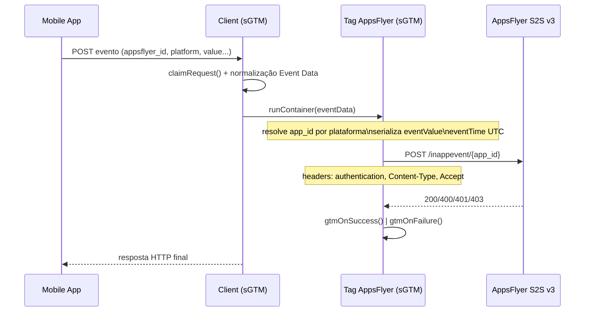

# SPEC-S2S-V3 — Tag AppsFlyer S2S (API v3) para Google Tag Manager Server-Side

| Metadado | Valor |
| :--- | :--- |
| **Documento** | `docs/spec/SPEC-S2S-V3.md` |
| **Status** | ✅ Aprovado |
| **Versão** | 1.0.0 |
| **Data de Criação** | 2026-09-12 |
| **Autor** | @fabiooliveir |
| **Issue Vinculada** | [#1 — Especificação Técnica e Contratos da Tag AppsFlyer S2S (API v3)](https://github.com/dados-que-batem/AppsFlyer/issues/1) |
| **Fase SDLC** | SDLC-1 (Spec) |
| **Metodologia** | Spec-Driven Development (SDD) |

---

## 1. Objetivo & Escopo

### 1.1 Objetivo

Definir formalmente o **contrato de dados**, as **regras de validação estruturais**, os **schemas canônicos** e as **restrições operacionais** da API Server-to-Server (S2S v3) do AppsFlyer para ingestão de eventos in-app (`event_in_app`) a partir de contêineres do Google Tag Manager Server-Side (sGTM).

Este documento é a fonte única de verdade da Issue #1 e servirá de base para as Issues subsequentes do ciclo SDLC.

### 1.2 Goals (Dentro do Escopo)

- Especificar a arquitetura de ingestão e o ciclo de vida do evento no sGTM.
- Formalizar o contrato HTTP REST da API v3 (método, URL, cabeçalhos).
- Definir o schema canônico do payload com validação estrita de tipos, regex, enums, limites e restrições.
- Formalizar as regras de transformação de plataforma:
  - Prefixo compulsório `id` para iOS App ID (ex: `123456789` → `id123456789`).
  - Namespace válido de pacote Android (ex: `com.empresa.aplicacao`).
- Formalizar a serialização estrita de `eventValue` como JSON stringificado ou string vazia `""`.
- Definir regras temporais para `eventTime` no formato UTC estrito (`yyyy-MM-dd HH:mm:ss.SSS`).
- Descrever o modelo de permissões e governança de dados no sGTM.
- Especificar a matriz de identificadores e o manual de erros HTTP.
- Implementar suite automatizada de testes para validar payloads válidos e inválidos contra o JSON Schema.

### 1.3 Non-Goals (Fora do Escopo desta Issue)

| Tema | Issue |
| :--- | :--- |
| Criação do arquivo completo `template.tpl` com UI visual e Sandboxed JS | Issue #2 / #3 |
| Implementação da chamada de rede `sendHttpRequest` e callbacks no GTM | Issue #4 |
| Mapeamento avançado de ATT, hashing SHA-256 de dados sensíveis e filtros de parceiros | Issue #5 |
| Suite de testes unitários interna no motor do GTM (`___TESTS___`) | Issue #6 |

---

## 2. Arquitetura de Ingestão

### 2.1 Topologia

```
┌─────────────┐    HTTPS     ┌─────────────────────────┐    HTTPS    ┌─────────────────────┐
│ Mobile App  │ ───────────▶ │  sGTM (Cloud Run)       │ ──────────▶ │  AppsFlyer S2S v3   │
│ (SDK GA4/   │              │  Client ▶ Trigger ▶ Tag │             │  api3.appsflyer.com  │
│  Firebase)  │              │  ▶ sendHttpRequest      │             │  /inappevent/{app}   │
└─────────────┘              └─────────────────────────┘             └─────────────────────┘
```

O pipeline opera em etapas sequenciais:

1. **Emissão** — o evento gerado na aplicação móvel é expedido para o endpoint do sGTM via SDK do Google Analytics for Firebase ou chamada HTTP REST dedicada. O `appsflyer_id` (obtido via `getAppsFlyerUID`) deve ser anexado como parâmetro complementar.
2. **Ingestão** — um *Client* do sGTM reivindica a requisição e decompõe a carga em Event Data.
3. **Orquestração** — acionadores (*triggers*) avaliam as chaves do Event Data e disparam a *Tag* apenas para eventos válidos.
4. **Transformação** — a tag compila o payload: resolve o `app_id` por plataforma (prefixo `id` no iOS), serializa `eventValue` e normaliza `eventTime` para UTC.
5. **Egress** — `sendHttpRequest` despacha o POST assíncrono para a API v3 com os cabeçalhos de autenticação.
6. **Resposta** — a tag sinaliza `gtmOnSuccess()`/`gtmOnFailure()` conforme o código de status remoto.

### 2.2 Ciclo de Vida no sGTM



---

## 3. Contrato HTTP REST (API v3)

- **Método**: `POST`
- **URL**: `https://api3.appsflyer.com/inappevent/{app_id}`
  - **iOS**: `{app_id}` com prefixo `id` obrigatório — regex `^id[0-9]+$` (ex: `id123456789`).
  - **Android**: `{app_id}` como reverse-domain — regex `^[a-zA-Z][a-zA-Z0-9_]*(\.[a-zA-Z][a-zA-Z0-9_]*)+$` (ex: `com.empresa.aplicacao`).
- **Cabeçalhos HTTP**:
  - `authentication`: `<S2S_TOKEN>` (token criptográfico gerado no *Security Center* do AppsFlyer).
  - `Content-Type`: `application/json`
  - `Accept`: `application/json`
- **Transporte**: HTTPS/TLS 1.2+.
- **Restrição física**: payload ≤ **1 KB (1024 bytes)** após serialização.
- **Batching**: proibido — cada requisição representa **um único evento** de um único dispositivo.

---

## 4. Estrutura do Payload JSON

### 4.1 Exemplo Canônico

```json
{
  "appsflyer_id": "1617274484000-5786735",
  "customer_user_id": "usr_998412",
  "eventName": "af_purchase",
  "eventCurrency": "EUR",
  "eventValue": "{\"af_revenue\": 29.99, \"af_currency\": \"EUR\", \"af_content_id\": \"sub_premium\"}",
  "eventTime": "2026-03-30 14:15:30.000",
  "ip": "193.136.0.25",
  "ua": "Mozilla/5.0 (iPhone; CPU iPhone OS 17_4 like Mac OS X) AppleWebKit/605.1.15",
  "os": "17.4",
  "bundleIdentifier": "com.empresa.aplicacao",
  "app_version_name": "2.4.1",
  "advertising_id": "38400000-8cf0-11bd-b23e-10b96e40000d",
  "idfa": "EA7583CD-A667-48BC-B806-42ECB2B48D12",
  "idfv": "E621E1F8-C36C-495A-93FC-0C247A3E6E5F",
  "sharing_filter": "all"
}
```

---

## 5. Matriz de Identificadores

| Identificador | Campo no Payload | Obrigatoriedade | Especificações Técnicas e Função |
| :--- | :--- | :--- | :--- |
| **AppsFlyer ID** | `appsflyer_id` | Mandatório | Regex `^\d{13}-\d{1,19}$` (ex: `1617274484000-5786735`). Gerado pelo SDK no primeiro arranque. Necessário para localizar o registro de instalação. |
| **Customer User ID** | `customer_user_id` | Opcional (Rec.) | ID atribuído pela organização no backend. Permite associar eventos de servidor a usuários autenticados. |
| **Google Advertising ID** | `advertising_id` | Condicional (Android) | GAID do dispositivo no formato UUID. Indispensável para SRNs (*Self-Attributing Networks*) e análise de incrementalidade. |
| **Identifier for Advertisers** | `idfa` | Condicional (iOS) | UUID da Apple. Apenas pode ser transmitido com autorização explícita via diálogo ATT (*App Tracking Transparency*). |
| **Identifier for Vendors** | `idfv` | Recomendado (iOS) | UUID do fabricante. Critério persistente de agregação quando o IDFA está indisponível. |

---

## 6. Regras de Campos e Tipos

| Campo | Tipo | Obrigatório | Restrições & Formato |
| :--- | :--- | :--- | :--- |
| `appsflyer_id` | String | **Sim** | Regex `^\d{13}-\d{1,19}$` — 13 dígitos (timestamp), traço e 1 a 19 dígitos (ex: `1617274484000-5786735`). |
| `eventName` | String | **Sim** | String não vazia, máx 255 caracteres (ex: `af_purchase`, `af_login`). |
| `eventValue` | String | **Sim** | **Obrigatoriamente JSON stringificado** ou string vazia `""`. Nunca objeto JSON cru. |
| `eventTime` | String | Opcional (Rec.) | Formato UTC estrito: `yyyy-MM-dd HH:mm:ss.SSS`. |
| `eventCurrency` | String | Condicional | Código ISO 4217 de 3 letras (ex: `USD`, `BRL`, `EUR`), requerido se houver receita. |
| `customer_user_id` | String | Opcional | ID interno de usuário da organização. |
| `ip` | String | Opcional | IPv4 ou IPv6 válido. |
| `ua` | String | Opcional | User-Agent string. |
| `os` | String | Opcional | Versão do sistema operacional (ex: `17.4`, `14.0`). |
| `bundleIdentifier` | String | Opcional | Bundle ID do aplicativo (formato reverse-domain). |
| `app_version_name` | String | Opcional | Versão de lançamento do app (ex: `1.2.0`). |
| `advertising_id` | String | Opcional | GAID para Android (formato UUID). |
| `idfa` | String | Opcional | IDFA para iOS (formato UUID, condicionado a consentimento ATT). |
| `idfv` | String | Opcional | IDFV para iOS (formato UUID). |
| `sharing_filter` | String/Array | Opcional | `"all"` ou lista de redes autorizadas/bloqueadas. |

### 6.1 Semântica de Campos Adicionais

Propriedades **não declaradas** no contrato são **rejeitadas** (schema `additionalProperties: false`), garantindo contrato estrito e evitando divergências silenciosas.

---

## 7. Regras de Transformação

### 7.1 Resolução de Plataforma (App ID no Path)

| Plataforma | Formato | Exemplo | Regra |
| :--- | :--- | :--- | :--- |
| iOS | `id` + numérico | `id123456789` | Prefixo `id` **compulsório**. Sem o prefixo, a API responde `200 OK` descartando silenciosamente o evento. |
| Android | reverse-domain | `com.empresa.aplicacao` | Deve corresponder exatamente ao nome de pacote registrado na Google Play Store. |

### 7.2 Serialização de `eventValue`

- O valor deve ser a representação textual de um objeto JSON, escapada adequadamente:
  `"eventValue": "{\"af_revenue\": 29.99, \"af_currency\": \"EUR\"}"`
- Na ausência de parâmetros adicionais, usar string vazia: `"eventValue": ""`.
- **Nunca** enviar objeto JSON nativo/aninhado — a API rejeita a requisição.

### 7.3 Temporalidade de `eventTime`

- Formato estrito UTC: `yyyy-MM-dd HH:mm:ss.SSS` (ex: `2026-03-30 14:15:30.000`).
- Timestamps com desvio de fuso horário, datas futuras ou atraso superior à meia-noite UTC do dia seguinte são **sobrescritos** pelo horário de recebimento no servidor do AppsFlyer.

### 7.4 `eventCurrency` Condicional

- Obrigatório quando o evento carrega receita (`af_revenue`) em `eventValue`.

---

## 8. Modelo de Permissões no sGTM

A tag (Sandboxed JavaScript) opera sob o princípio do **menor privilégio**; toda chamada sensível exige concessão explícita em `sendHttpRequest` → `send_http`.

| Permissão | Escopo Declarativo Recomendado |
| :--- | :--- |
| `send_http` | Somente `https://api3.appsflyer.com/*` (método `HTTP`). |
| `read_event_data` | Somente as chaves consumidas pela tag (ex: `appsflyer_id`, `event_name`, `value`). |
| `read_request` | Somente `headers` (user-agent) e `ip` — jamais o body completo quando desnecessário. |
| `logging` | Restrita a sessões de depuração/Preview para controlar custos de Cloud Logging. |

---

## 9. Casos de Borda & Falhas (Edge Cases)

### 9.1 Payload > 1024 bytes (1 KB)

- **Regra**: a API rejeita requisições acima de 1 KB com erro 400.
- **Mitigação**: a validação e a tag devem calcular o tamanho do payload serializado (`Buffer.byteLength`) antes do despacho; se exceder 1 KB, registrar alerta e **truncar/remover parâmetros não-essenciais de `eventValue`** ou **abortar graciosamente** com falha informada.

### 9.2 `eventValue` enviado como Objeto JSON

- **Regra**: a API rejeita requisições onde `eventValue` não é string.
- **Mitigação**: o schema rejeita explicitamente `typeof eventValue !== 'string'`.

### 9.3 App ID iOS sem prefixo `id`

- **Regra**: a API responde `200 OK` **silenciosamente descartando** o evento se o ID for puramente numérico sem o prefixo `id`.
- **Mitigação**: o schema e a lógica de normalização devem impor ou injetar automaticamente o prefixo `id`.

### 9.4 `eventTime` com desvio temporal

- **Regra**: timestamps no futuro ou com atraso > 24h UTC são sobrescritos pelo AppsFlyer.
- **Mitigação**: validar o formato `yyyy-MM-dd HH:mm:ss.SSS` em UTC estrito.

### 9.5 Tentativa de Envio em Lote (Batching)

- **Regra**: o endpoint não suporta arrays de eventos.
- **Mitigação**: o schema exige que a raiz seja estritamente um `object`, proibindo `array`.

---

## 10. Especificação de Erros HTTP

| Código HTTP | Mensagem de Resposta | Causa Primária | Ação Corretiva |
| :--- | :--- | :--- | :--- |
| **200 OK** | Sucesso aparente | Prefixo `id` ausente no iOS ou atraso na reconciliação. | Verificar prefixo `id`; validar dados após 1 hora no painel. |
| **400 Bad Request** | Failed to Authenticate | Token S2S inválido, expirado ou *Dev Key* legada. | Obter token S2S atualizado no Security Center. |
| **400 Bad Request** | appsflyer_id is a mandatory field | Identificador ausente ou mal formatado. | Confirmar `getAppsFlyerUID` no código móvel. |
| **400 Bad Request** | Payload is missing or failed to parse | JSON malformado, limite de 1 KB excedido ou batching. | Reduzir dimensões, verificar escape de `eventValue`, enviar 1 evento/requisição. |
| **401 Unauthorized** | Unauthorized | Token S2S sem permissão para o `app_id`. | Validar acessos administrativos da conta. |
| **403 Forbidden** | Forbidden | Plano da conta sem suporte a eventos S2S. | Atualizar pacote comercial com o gestor de conta. |

---

## 11. Verificação & Testes

### 11.1 Testes Automatizados

Suite em Node.js (validador AJV) — `npm test`:

- **Asserções positivas** (payloads válidos): mínimo, completo com receita, iOS, Android. 100% de sucesso esperado.
- **Asserções negativas** (payloads inválidos): ausência de `appsflyer_id`, `eventValue` como objeto, timestamp fora do padrão, payload > 1024 bytes, raiz como array, campo desconhecido. 100% de rejeição esperada.

### 11.2 Artefatos Vinculados

| Artefato | Path |
| :--- | :--- |
| Especificação técnica | `docs/spec/SPEC-S2S-V3.md` |
| JSON Schema (Draft-07) | `schemas/appsflyer-s2s-v3.schema.json` |
| Suite de validação | `tests/schemas/validate-schema.test.js` |

---

## 12. Referências

- AppsFlyer — Send Event (S2S Events API v3): https://dev.appsflyer.com/hc/reference/s2s-events-api3-post
- AppsFlyer — Server-to-server events API for mobile (S2S-mobile): https://support.appsflyer.com/hc/en-us/articles/207034486
- AppsFlyer — Bulletin: Upgrading the S2S API: https://support.appsflyer.com/hc/en-us/articles/20509378973457
- Google — Sandboxed JavaScript: https://developers.google.com/tag-platform/tag-manager/templates/sandboxed-javascript
- Google — Server-side custom template permissions: https://developers.google.com/tag-platform/tag-manager/server-side/permissions
- Google — Server-side tagging for mobile apps: https://developers.google.com/tag-platform/tag-manager/server-side/server-side-tagging-for-mobile-apps